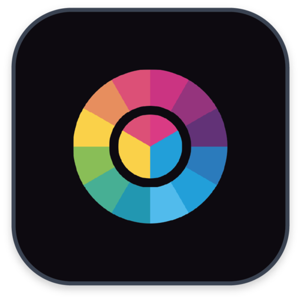

# Color picker: Stay in harmony #

Changes
=================

#### 1.1.1

- Updated Qt framworks to version 8.6
- Added CHANGES.md to track version changes

#### 1.1.2

- Added genicc native ICC generation tool
- Fixed ColorSync integration, now rendering to sRGB
- Updated Qt framworks to version 8.10.1