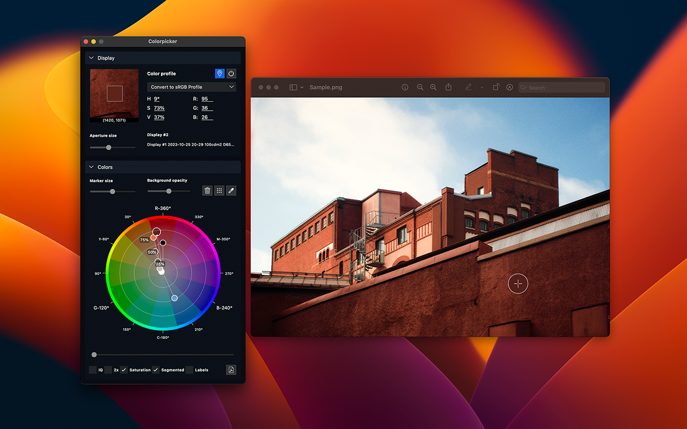

#  Colorpicker #

[](https://github.com/mikaelsundell/icloud-snapshot/blob/master/license.md)

Table of Contents
=================

- [ Colorpicker](#-colorpicker)
- [Table of Contents](#table-of-contents)
  - [Introduction](#introduction)
      - [Quick start](#quick-start)
  - [Menu](#menu)
      - [Edit](#edit)
      - [View](#view)
      - [Help](#help)
  - [Display section](#display-section)
      - [Options](#options)
  - [Colors section](#colors-section)
      - [Options](#options-1)
      - [Color wheel](#color-wheel)
  - [Advanced](#advanced)
      - [Display profiles](#display-profiles)
      - [Color processing in LCMS](#color-processing-in-lcms)
  - [Privacy \& Security](#privacy--security)
  - [Build \& Package](#build--package)
  - [Web Resources](#web-resources)
  - [Copyright](#copyright)

Introduction
------------



Colorpicker is a versatile Mac application designed to select and capture colors from various screens. It features a color wheel visualizer, aiding users in color design by offering tools to create harmonious color palettes and explore color relationships.

<a href="https://apps.apple.com/se/app/colorpicker-colors-in-harmony/id6503638316?l=en-GB&mt=12" target="_blank" style="cursor: pointer;">
    
</a>

#### Quick start

The color picker needs to be active to pick colors. The app is always active when launched but can also be activated via `View > Turn On [Space]`. Once active, the application will display the current color interactively on an HSL color wheel. 

To start picking colors, use the color picker button or `Edit > Capture from Pick [Enter]`. Colors will begin to appear on the color wheel. 

To end the color picking tool, use either the `Right Mouse Button` or `Esc`. After ending the color pick, the app will no longer be active. You can now check colors by clicking on them in the color wheel.


Menu
-------------

#### Edit

-  **Capture from pick**: Capture color from single pick.
-  **Capture from sweep**: Capture color by dragging out a rectangle and pick the most dominant colors.
- **Clear**: Clear all colors
- **Copy RGB as text**: Copy selected color as RGB to clipboard
- **Copy HSV as text**: Copy selected color as HSV to clipboard
- **Copy HSL as text**: Copy selected color as HSL to clipboard
- **Copy HEX as text**: Copy selected color as HEX to clipboard
- **Copy ICC profile as text**: Copy current ICC profile as text
- **Copy color as bitmap**: Copy selected color as bitmap to clipboard

#### View

-  **Turn on**: Start color picker.
-  **Pin**: Pin application on-top others.
- **Color values**: Select next and previous colors in color wheel.
- **Display values**: Set display mode for color values.
- **Magnification**: Set magnification multiple for aperture.
- **Capture colors**: Set the number colors to capture when dragging out a rectangle to pick the most dominant colors.
- **Show mouse location**: Show mouse location.
  
#### Help

- **Open Github README**: Open Github README page.
- **Open Github Issues**: Open Github Issues page.

Display section
-------------

#### Options

- **Color Profile**: Defines the color profile used for color picking and grid capture.
- **Aperture**: Specifies the size of the aperture for color picking and grid capture.

Colors section
-------------

#### Options

- **Marker Size**: Determines the size of the color markers.
- **Background Opacity**: Sets the opacity level of the color wheel.

#### Color wheel

The color wheel can be adjusted to fit your specific color requirements.

- **IQ**: Provides an approximation of the vector scope IQ line in HSV color space to verify skin tones.
- **2x**: Doubles the saturation values.
- **Saturation**: Displays saturation percentages.
- **Segmented**: Shows segmented colors instead of a gradient.
- **Labels**: Displays labels for the colors.

Advanced
-------------
#### Display profiles

The default native display values represent the inherent colors of the display. These color values are equivalent to a screenshot with the display profile (.icc) applied. You can switch between different display profiles to view color values in various color spaces, transformed according to the selected display profile (.icc).

#### Color processing in LCMS

Little CMS (LCMS) is a widely-used color management system in open-source projects. LCMS closely matches other color engines such as ColorSync, AdobeACE, and Reference ICC. While there may be slight variations between different engines, they generally produce similar results.

Privacy & Security
------------------

colorpicker uses macOS to create images from display and needs permission for `Screen recording`. Add Colorpicker app to the list of allowed applications in `System settings`.

Build & Package
------------------
Colorpicker is built using the ```build.sh``` script.

Build all - debug and release:
```shell
./build.sh all (--deploy)
```

Requires pipeline and 3rdparty build at the same level as Colorpicker.

* Pipeline            https://github.com/mikaelsundell/pipeline
* 3rdparty            https://github.com/mikaelsundell/3rdparty

Web Resources
-------------

* GitHub page:        https://github.com/mikaelsundell/colorpicker
* Issues              https://github.com/mikaelsundell/colorpicker/issues

Copyright
---------

**3rdparty libraries acknowledgment and copyright notice**

This product includes software developed by third parties. The copyrights and terms of use of these third-party libraries are fully acknowledged and respected. Below is a list of said libraries and their respective copyright notices:

App icon: Copyright flaticon.com

Giflib: Copyright (c) 1997 by Eric S. Raymond. All rights reserved.

LCMS2: Copyright (c) 1998-2012 by Marti Maria Saguer. All rights reserved.

Libjpeg-turbo: Copyright (C) 1994-1997 by Thomas G. Lane. Modifications in 2019 by Guido Vollbeding. All rights reserved.

LibWebp: Copyright 2010 by Google Inc. All Rights Reserved.

OpenCV: Copyright (C) 2015-2024, OpenCV Foundation, all rights reserved.

Tiff: Copyright (c) 1988-1997 by Sam Leffler and Copyright (c) 1991-1997 by Silicon Graphics, Inc. All rights reserved.

The Qt Company Ltd.: Copyright (C) 2016 by The Qt Company Ltd. All rights reserved.

sRGB color profile icc file, Copyright International Color Consortium, 2015

The use of the above-mentioned software within this product is in compliance with the respective licenses and/or terms and conditions of the copyright holders. The inclusion of these third-party libraries does not imply any endorsement by the copyright holders of the products developed using their software.
